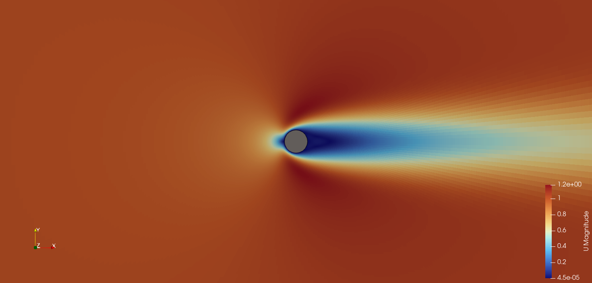

# Flow past a circular cylinder (2D, OpenFOAM)

# Flow past a circular cylinder (2D, OpenFOAM)

Verification study of steady laminar flow past a circular cylinder at Re = 20,
reproducing the test case of Ferziger, Perić & Street, *Computational Methods
for Fluid Dynamics*, sec. 9.12. Re = 200 (unsteady, vortex shedding) is planned
next.

**Status: in progress.** The grid study is complete and the pressure component
of the drag has been verified as second-order accurate. The viscous component
is still first-order accurate and is under investigation, so no validated drag
coefficient is claimed yet (see Open issues).

Solver: OpenFOAM v2606 (ESI).

## Problem definition

| | |
|---|---|
| Cylinder diameter | D = 1 |
| Free-stream velocity | U = 1 |
| Kinematic viscosity | nu = 0.05 |
| Reynolds number | Re = U D / nu = 20 |
| Domain | square, 16 D from the cylinder centre in each direction |

Boundary conditions, following sec. 9.11.2 of the book:

| Patch | Velocity | Pressure |
|---|---|---|
| inlet (left) | fixedValue (1 0 0) | zeroGradient |
| outlet (right) | zeroGradient | zeroGradient |
| top, bottom | symmetryPlane | symmetryPlane |
| cylinder | noSlip | zeroGradient |
| frontAndBack | empty | empty |

With Neumann conditions on pressure everywhere, the pressure level is fixed by a
reference point at (-15, 1, 0.5), and simpleFoam rescales the outlet flux to
match the inflow (adjustPhi). Because the rescaling fails for a zero initial
field, the run starts from the uniform free stream; the steady solution does not
depend on that choice.

## Grid family

Five O-grids, each a uniform refinement of the previous one by a factor of two
in both directions, as required for Richardson extrapolation.

| Level | Cells around | Radial cells | Total | Cell-to-cell radial ratio |
|---|---|---|---|---|
| L1 | 24 | 16 | 384 | 1.25 |
| L2 | 48 | 32 | 1 536 | 1.118034 |
| L3 | 96 | 64 | 6 144 | 1.057371 |
| L4 | 192 | 128 | 24 576 | 1.028286 |
| L5 | 384 | 256 | 98 304 | 1.014044 |

Note that `simpleGrading` in blockMesh takes the ratio of the last to the first
cell on an edge, not the cell-to-cell ratio: the entry is r^(N-1).

## Numerics

| | |
|---|---|
| Solver | simpleFoam, laminar |
| Convection | `bounded Gauss deferredCorrection linear` — CDS with deferred correction (eq. 8.22) |
| Diffusion | `Gauss linear corrected` |
| Gradients | `Gauss linear` |
| Pressure-velocity coupling | SIMPLE, no consistent |
| Under-relaxation | 0.8 (U), 0.2 (p) |
| Linear solvers | PCG/DIC for p, smoothSolver/symGaussSeidel for U |
| Stopping criterion | initial residuals below 1e-7 |

The convection scheme is the book's CDS, implemented with deferred correction so
that the implicit part stays diagonally dominant: far-field cell Péclet numbers
reach 60-90 on the coarsest grid. The converged solution is the same as pure CDS,
so per-grid errors remain comparable with the book's.

Under-relaxation factors are identical on all grids. This matters: simpleFoam
relaxes the momentum matrix before forming 1/A_P, so the Rhie-Chow flux
interpolation depends weakly on the relaxation factor, and varying it between
levels would contaminate the grid differences.

## Results

Drag coefficients, C = 2 F (rho = 1, U = 1, reference area = D x unit span):

| Level | Iterations | Cd | Pressure | Viscous | Iteration error (rel.) |
|---|---|---|---|---|---|
| L1 | 212 | 2.07999 | 1.17868 | 0.90132 | 8e-9 |
| L2 | 193 | 2.08978 | 1.21579 | 0.87399 | ~1e-9 |
| L3 | 435 | 2.09266 | 1.24042 | 0.85224 | 2.2e-7 |
| L4 | 1 391 | 2.09298 | 1.25266 | 0.84032 | 8.6e-7 |
| L5 | 4 679 | 2.09220 | 1.25811 | 0.83409 | 3.4e-6 |

Lift is zero to within the iteration error on every grid, as symmetry requires.

The iteration error is estimated from the Cd history as |delta| / (1 - lambda)
(sec. 5.7). It grows by a factor of four per refinement at a fixed residual
threshold, because the condition number of the pressure equation scales as 1/h^2
and the same residual therefore corresponds to a larger error. It remains at
least two orders of magnitude below the grid-to-grid differences, so it does not
affect the conclusions; a sixth level would require tightening the threshold by
a factor of four.

## Grid convergence

Differences between successive levels, and their ratios:

| | L1→L2 | L2→L3 | L3→L4 | L4→L5 | Ratios |
|---|---|---|---|---|---|
| Pressure | +0.03711 | +0.02463 | +0.01224 | +0.00545 | 1.51, 2.01, 2.25 |
| Viscous | -0.02733 | -0.02174 | -0.01193 | -0.00622 | 1.26, 1.82, 1.92 |
| Total | +0.00978 | +0.00289 | +0.00031 | -0.00077 | non-monotonic |

Both force components converge at first order, not second. Their errors are
nearly equal and opposite, so they largely cancel in the total: the total is the
difference of two first-order errors, its sequence is non-monotonic, and
Richardson extrapolation applied to it is not defensible. The components must be
extrapolated separately.

A practical consequence: on the coarsest grid the total drag is the closest to
the book's converged value, while its components are the furthest off, by 6.6%
and 9.0%. That is agreement by cancellation, not accuracy.

### Wall pressure treatment

`zeroGradient` assigns the adjacent cell value to the wall face, which is a
constant extrapolation and therefore first-order accurate on a stretched grid.
Sec. 7.1 of the book instead extrapolates the wall pressure linearly from the
interior.

`scripts/wall_pressure.py` recomputes the pressure force from the stored fields
with a linear extrapolation from the first two radial cells. No re-run is needed.

| | L1→L2 | L2→L3 | L3→L4 | L4→L5 | Ratios |
|---|---|---|---|---|---|
| Cell value | +0.03711 | +0.02463 | +0.01224 | +0.00545 | 1.51, 2.01, 2.25 |
| Extrapolated | +0.03052 | +0.01614 | +0.00393 | +0.00030 | 1.89, 4.11, 13.17 |

The ratio of 4.11 on levels 2-4 corresponds to an observed order of 2.04: the
first-order behaviour of the pressure component was caused by the wall treatment,
not by the discretization scheme. The last ratio of 13.17 is not explained; it is
well above the iteration error and may reflect cancellation between the remaining
second-order terms, including the polygonal approximation of the cylinder surface.

Correcting one component alone makes the total worse behaved, which is a direct
confirmation that the earlier agreement came from cancellation.

Current estimates, extrapolated per component: pressure 1.2638, viscous 0.8273,
total 2.0911, against the book's converged value of 2.083 (+0.39%).

## Open issues

- The viscous component is still first order (observed 0.94). The likely cause is
  the same in kind: OpenFOAM evaluates the wall-normal velocity gradient as a
  two-point one-sided difference, which is first-order accurate on a stretched
  grid. A three-point formula using the wall and the first two cells should
  restore second order, and can be tested in post-processing as was done for
  pressure.
- The remaining 0.39% gap from the book is unexplained. Extrapolated values should
  be independent of grid and scheme, so either the two continuous problems differ
  or one extrapolation is unreliable. Domain and boundary conditions have been
  checked and match; the viscous extrapolation rests on an observed order that is
  still drifting, and is the weaker of the two.
- The cylinder surface is a polygon inscribed in the circle. The perimeter error
  is second order (0.3% on L1) and is absorbed into the discretization error.
- Even a fully converged result here is a code-to-code verification against a 2D
  reference, not a validation against physical measurements.

## Reproducing

Requires OpenFOAM v2606 with its environment loaded.
`re20/` is the template case: schemes, boundary conditions and solver settings
live there in a single copy, and `scripts/grid_study.py` changes only the three
mesh entries of `blockMeshDict` plus the iteration cap. This guarantees by
construction that nothing but the grid differs between levels. Generated cases go
to `runs/` (not tracked); results are collected in
`results/re20_grid_study.csv` (tracked).

Post-processing:

cd runs/re20/L5 && postProcess -func writeCellCentres -latestTime
python3 scripts/wall_pressure.py runs/re20/L5
python3 scripts/iteration_error.py # from a case directory

## Reference

J. H. Ferziger, M. Perić, R. L. Street, *Computational Methods for Fluid
Dynamics*, 4th ed., Springer, 2020 — sec. 7.1, 9.11, 9.12.
