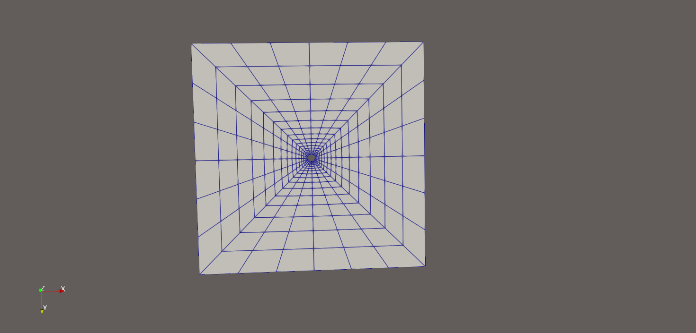
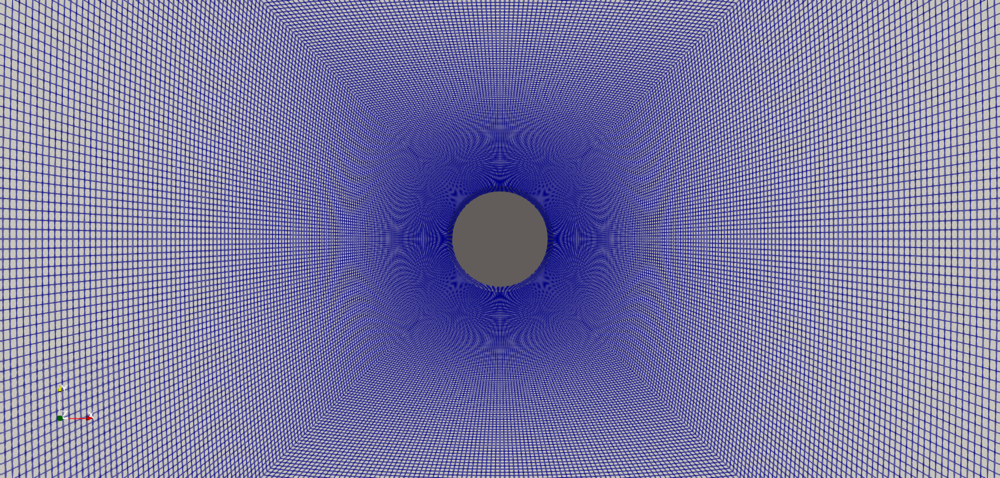

# Flow past a circular cylinder (2D, OpenFOAM)

# Flow past a circular cylinder (2D, OpenFOAM)

Verification study of steady laminar flow past a circular cylinder at Re = 20,
reproducing the test case of Ferziger, Perić & Street, *Computational Methods
for Fluid Dynamics*, sec. 9.12. Re = 200 (unsteady, vortex shedding) is planned
next.

**Status: in progress.** The grid study is complete and the pressure component
of the drag has been verified as second-order accurate. The viscous component
is still first-order accurate and is under investigation, so no validated drag
coefficient is claimed yet (see Open issues).

Solver: OpenFOAM v2606 (ESI).

## Problem definition

| | |
|---|---|
| Cylinder diameter | D = 1 |
| Free-stream velocity | U = 1 |
| Kinematic viscosity | nu = 0.05 |
| Reynolds number | Re = U D / nu = 20 |
| Domain | square, 16 D from the cylinder centre in each direction |

Boundary conditions, following sec. 9.11.2 of the book:

| Patch | Velocity | Pressure |
|---|---|---|
| inlet (left) | fixedValue (1 0 0) | zeroGradient |
| outlet (right) | zeroGradient | zeroGradient |
| top, bottom | symmetryPlane | symmetryPlane |
| cylinder | noSlip | zeroGradient |
| frontAndBack | empty | empty |

With Neumann conditions on pressure everywhere, the pressure level is fixed by a
reference point at (-15, 1, 0.5), and simpleFoam rescales the outlet flux to
match the inflow (adjustPhi). Because the rescaling fails for a zero initial
field, the run starts from the uniform free stream; the steady solution does not
depend on that choice.

## Grid family

Five O-grids, each a uniform refinement of the previous one by a factor of two
in both directions, as required for Richardson extrapolation.

| Level | Cells around | Radial cells | Total | Cell-to-cell radial ratio |
|---|---|---|---|---|
| L1 | 24 | 16 | 384 | 1.25 |
| L2 | 48 | 32 | 1 536 | 1.118034 |
| L3 | 96 | 64 | 6 144 | 1.057371 |
| L4 | 192 | 128 | 24 576 | 1.028286 |
| L5 | 384 | 256 | 98 304 | 1.014044 |

Note that `simpleGrading` in blockMesh takes the ratio of the last to the first
cell on an edge, not the cell-to-cell ratio: the entry is r^(N-1).

## Numerics

| | |
|---|---|
| Solver | simpleFoam, laminar |
| Convection | `bounded Gauss deferredCorrection linear` — CDS with deferred correction (eq. 8.22) |
| Diffusion | `Gauss linear corrected` |
| Gradients | `Gauss linear` |
| Pressure-velocity coupling | SIMPLE, no consistent |
| Under-relaxation | 0.8 (U), 0.2 (p) |
| Linear solvers | PCG/DIC for p, smoothSolver/symGaussSeidel for U |
| Stopping criterion | initial residuals below 1e-7 |

The convection scheme is the book's CDS, implemented with deferred correction so
that the implicit part stays diagonally dominant: far-field cell Péclet numbers
reach 60-90 on the coarsest grid. The converged solution is the same as pure CDS,
so per-grid errors remain comparable with the book's.

Under-relaxation factors are identical on all grids. This matters: simpleFoam
relaxes the momentum matrix before forming 1/A_P, so the Rhie-Chow flux
interpolation depends weakly on the relaxation factor, and varying it between
levels would contaminate the grid differences.

## Results

Drag coefficients, C = 2 F (rho = 1, U = 1, reference area = D x unit span):

| Level | Iterations | Cd | Pressure | Viscous | Iteration error (rel.) |
|---|---|---|---|---|---|
| L1 | 278 | 2.07999185 | 1.17867501 | 0.90131684 | 1.3e-9 |
| L2 | 250 | 2.08977514 | 1.21578860 | 0.87398654 | 4.0e-11 |
| L3 | 576 | 2.09266290 | 1.24041912 | 0.85224378 | 2.2e-9 |
| L4 | 1 889 | 2.09297440 | 1.25265807 | 0.84031633 | 8.7e-9 |
| L5 | 6 556 | 2.09219582 | 1.25810840 | 0.83408741 | 3.8e-8 |

Lift is zero to within the iteration error on every grid, as symmetry requires.

### Convergence thresholds

Two nested loops are involved. The outer loop is SIMPLE itself, counted as time
steps by OpenFOAM; the inner loop is the linear solver called within each outer
iteration. `residualControl` under `SIMPLE` stops the outer loop when the initial
residual of a field drops below its threshold; `tolerance` and `relTol` under
`solvers` stop the inner loop. The inner threshold must sit well below the outer
one, otherwise the linear solver stops improving the solution before the outer
residual can reach its target.

The iteration error on Cd is estimated from its own history as
|delta| / (1 - lambda), where delta is the change between successive outer
iterations and lambda the mean ratio of successive deltas (sec. 5.7). At a fixed
residual threshold this error grows by a factor of four per refinement, because
the condition number of the pressure equation scales as 1/h^2 and the same
residual therefore corresponds to a larger error.

Thresholds were initially 1e-7 (outer) and 1e-10 (inner). At those values the Cd
history on the finest grid was still drifting steadily when the run stopped
(lambda = 0.9975 over the last iterations), which makes the error estimate
sensitive to lambda. They were tightened to 1e-9 and 1e-12, at a cost of about
30% more iterations. The iteration error on the finest grid fell from 3.4e-6 to
3.8e-8, while the grid-to-grid differences and observed orders below were
unchanged to three digits — confirming that the first-order behaviour of both
force components is not an artefact of incomplete convergence.

The shifts between the two runs (1e-8 to 1.7e-6 on the pressure component) match
the iteration errors estimated before the re-run, which is an independent check
on the estimate itself.

## Grid convergence

Assuming a single dominant error term, phi(h) = phi_exact + C h^p, the ratio of
successive grid-to-grid differences is r^p, where r = 2 is the refinement ratio.
Neither phi_exact nor C appears, so the observed order follows from three grids
alone: p = log2(d1/d2).

| | L1→L2 | L2→L3 | L3→L4 | L4→L5 | Ratios (order) |
|---|---|---|---|---|---|
| Pressure | +0.037114 | +0.024631 | +0.012239 | +0.005450 | 1.51 (0.59), 2.01 (1.01), 2.25 (1.17) |
| Viscous | -0.027330 | -0.021743 | -0.011927 | -0.006229 | 1.26 (0.33), 1.82 (0.87), 1.91 (0.94) |
| Total | +0.009783 | +0.002888 | +0.000312 | -0.000779 | non-monotonic |

Both force components converge at first order, not second. Their errors are
nearly equal and opposite, so they largely cancel in the total: the total is the
difference of two first-order errors, its sequence changes sign between the two
finest grids, and Richardson extrapolation applied to it is not defensible. The
components must be extrapolated separately.

A practical consequence: on the coarsest grid the total drag is the closest to
the book's converged value, while its components are the furthest off. That is
agreement by cancellation, not accuracy.

The first ratio in each row is far from its asymptotic value: the coarsest grid
is outside the range where a single error term dominates.

### Wall pressure treatment

The interior schemes are second order, but that property does not extend to the
boundary. `zeroGradient` assigns the adjacent cell value to the wall face, which
is a constant extrapolation and therefore first-order accurate. Sec. 7.1 of the
book instead extrapolates the wall pressure linearly from the interior.

The boundary condition itself is not a free choice: mass conservation on an
impermeable wall forces a zero normal gradient on the pressure correction. What
is free is how the wall value is reconstructed when integrating the force, which
is a post-processing step. `scripts/wall_pressure.py` recomputes the pressure
force from the stored fields, extrapolating linearly from the first two radial
cell centres to the wall face. No re-run is needed, so grids, fields and schemes
are identical between the two columns below.

| | L1→L2 | L2→L3 | L3→L4 | L4→L5 | Ratios (order) |
|---|---|---|---|---|---|
| Cell value | +0.037114 | +0.024631 | +0.012239 | +0.005450 | 1.51 (0.59), 2.01 (1.01), 2.25 (1.17) |
| Extrapolated | +0.030521 | +0.016142 | +0.003931 | +0.000297 | 1.89 (0.92), 4.11 (2.04), 13.23 (3.73) |

Changing only the wall reconstruction raises the observed order from 1.01 to 2.04
on levels 2-4, so the first-order behaviour of the pressure component comes from
the wall treatment and not from the discretization scheme. The order is verified
on one triple, not demonstrated across the whole family: the last ratio of 13.23
lies above the theoretical value of 4, which signals that a single error term no
longer dominates there. It is two orders of magnitude above the iteration error
and was unchanged by the tighter thresholds, so it is not iterative noise;
cancellation between second-order contributions is a plausible explanation but
has not been verified.

The script was validated separately against an analytic pressure field with a
known exact surface integral, where it produced ratios converging to 4.

Correcting one component alone makes the total worse behaved, which is a direct
confirmation that the earlier agreement came from cancellation.

Extrapolated per component: pressure 1.2639, viscous 0.8273, total 2.0911,
against the book's converged value of 2.083 (+0.39%).

## Open issues

- The viscous component is still first order (observed 0.94). The cause is likely
  the same in kind: the wall shear comes from a two-point one-sided difference of
  the velocity, whose leading error is proportional to the wall distance and is
  therefore first order even on a uniform grid. A three-point formula through the
  wall and the first two cells cancels that term, and can be tested in
  post-processing as was done for pressure. Note that this has nothing to do with
  the convection scheme: both components are extracted from the same converged
  field, and changing only how the wall pressure is read moved one of them to
  second order.
- The remaining 0.39% gap from the book is unexplained. Extrapolated values should
  be independent of grid and scheme, so either the two continuous problems differ
  or one extrapolation is unreliable. Domain and boundary conditions have been
  checked and match; the viscous extrapolation rests on an observed order that is
  still drifting, and is the weaker of the two.
- The cylinder surface is a polygon inscribed in the circle. The perimeter error
  is second order (0.3% on L1) and is absorbed into the discretization error.
- Even a fully converged result here is a code-to-code verification against a 2D
  reference, not a validation against physical measurements.

## Reproducing

Requires OpenFOAM v2606 with its environment loaded.
`re20/` is the template case: schemes, boundary conditions and solver settings
live there in a single copy, and `scripts/grid_study.py` changes only the three
mesh entries of `blockMeshDict` plus the iteration cap. This guarantees by
construction that nothing but the grid differs between levels. Generated cases go
to `runs/` (not tracked); results are collected in
`results/re20_grid_study.csv` (tracked).

Post-processing:

cd runs/re20/L5 && postProcess -func writeCellCentres -latestTime
python3 scripts/wall_pressure.py runs/re20/L5
python3 scripts/iteration_error.py # from a case directory

## Reference

J. H. Ferziger, M. Perić, R. L. Street, *Computational Methods for Fluid
Dynamics*, 4th ed., Springer, 2020 — sec. 7.1, 9.11, 9.12.
